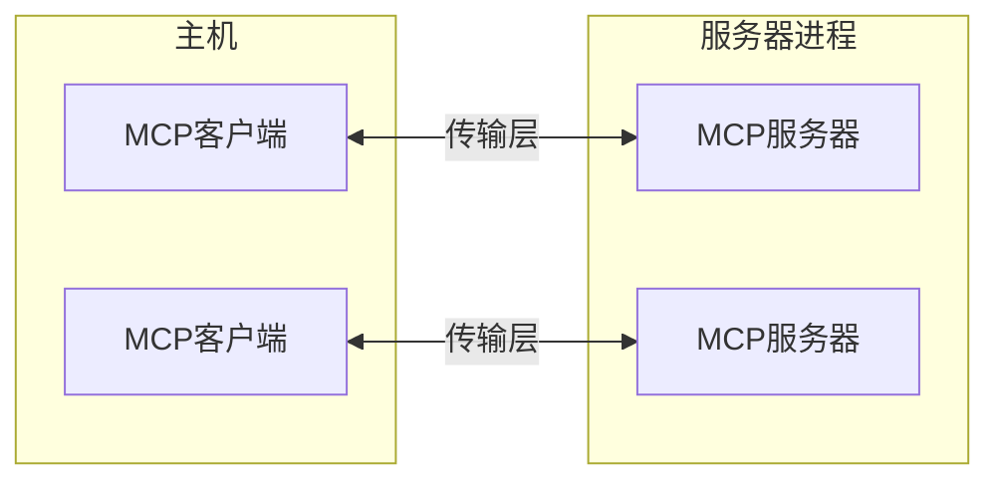
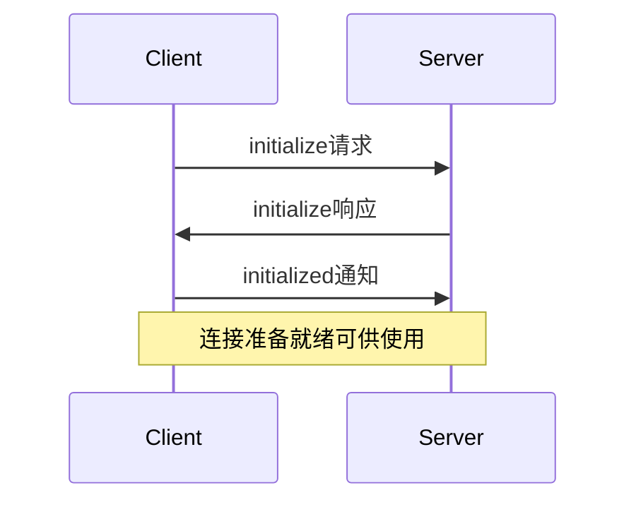

# Model Context Protocol (MCP) 中文文档

[mcp-agent]: https://github.com/lastmile-ai/mcp-agent

[Mcp.el]: https://github.com/lizqwerscott/mcp.el

[Roo Code]: https://roocode.com

[Goose]: https://block.github.io/goose/docs/goose-architecture/#interoperability-with-extensions

[Windsurf]: https://codeium.com/windsurf

[Daydreams]: https://github.com/daydreamsai/daydreams

[SpinAI]: https://spinai.dev

[OpenSumi]: https://github.com/opensumi/core

[oterm]: https://github.com/ggozad/oterm

[资源]: https://modelcontextprotocol.io/docs/concepts/resources

[提示词]: https://modelcontextprotocol.io/docs/concepts/prompts

[工具]: https://modelcontextprotocol.io/docs/concepts/tools

[采样]: https://modelcontextprotocol.io/docs/concepts/sampling

## 客户端详情

### Claude 桌面应用

Claude桌面应用程序提供了对MCP的全面支持，实现了与本地工具和数据源的深度集成。

**主要特点：**

* 完全支持资源功能，允许附加本地文件和数据
* 支持提示词模板
* 工具集成，用于执行命令和脚本
* 本地服务器连接，增强隐私和安全性

> ⓘ 注意：Claude.ai网页应用目前不支持MCP。MCP功能仅在桌面应用程序中可用。

### 5ire

[5ire](https://github.com/nanbingxyz/5ire)是一个开源的跨平台桌面AI助手，通过MCP服务器支持工具功能。

**主要特点：**

* 内置的MCP服务器可以快速启用和禁用。
* 用户可以通过修改配置文件添加更多服务器。
* 开源且用户友好，适合初学者使用。
* 未来将持续改进对MCP的支持。

### BeeAI框架

[BeeAI框架](https://i-am-bee.github.io/beeai-framework)是一个开源框架，用于构建、部署和大规模提供强大的智能代理工作流程。该框架包括**MCP工具**，这是一个原生功能，简化了将MCP服务器集成到智能代理工作流程中的过程。

**主要特点：**

* 无缝将MCP工具整合到智能代理工作流程中。
* 快速从连接的MCP客户端实例化框架原生工具。
* 计划未来支持智能代理MCP功能。

**了解更多：**

* [在智能代理工作流程中使用MCP工具的示例](https://i-am-bee.github.io/beeai-framework/#/typescript/tools?id=using-the-mcptool-class)

### Cline

[Cline](https://github.com/cline/cline)是VS Code中的自主编码代理，可以编辑文件、运行命令、使用浏览器等——每一步都需要您的许可。

**主要特点：**

* 通过自然语言创建和添加工具（例如"添加一个搜索网络的工具"）
* 通过`~/Documents/Cline/MCP`目录与他人共享Cline创建的自定义MCP服务器
* 显示已配置的MCP服务器及其工具、资源和任何错误日志

### Continue

[Continue](https://github.com/continuedev/continue)是一个开源AI代码助手，内置支持所有MCP功能。

**主要特点**

* 输入"@"以提及MCP资源
* 提示模板以斜杠命令形式显示
* 在聊天中直接使用内置和MCP工具
* 支持VS Code和JetBrains IDE，兼容任何LLM

### Cursor

[Cursor](https://docs.cursor.com/advanced/model-context-protocol)是一个AI代码编辑器。

**主要特点**：

* 在Cursor Composer中支持MCP工具
* 同时支持STDIO和SSE

### Emacs Mcp

[Emacs Mcp](https://github.com/lizqwerscott/mcp.el)是一个专为与MCP服务器交互而设计的Emacs客户端，实现无缝连接和交互。它为[gptel](https://github.com/karthink/gptel)和[llm](https://github.com/ahyatt/llm)等AI插件提供MCP工具调用支持，遵循Emacs的标准工具调用格式。这种集成增强了Emacs生态系统中AI工具的功能。

**主要特点：**

* 为Emacs提供MCP工具支持。

### Firebase Genkit

[Genkit](https://github.com/firebase/genkit)是Firebase的SDK，用于构建和集成生成式AI功能到应用程序中。[genkitx-mcp](https://github.com/firebase/genkit/tree/main/js/plugins/mcp)插件使得将MCP服务器作为客户端使用或从Genkit工具和提示创建MCP服务器成为可能。

**主要特点：**

* 客户端支持工具和提示（部分支持资源）
* 丰富的发现功能，支持Genkit的开发UI游乐场
* 与Genkit现有工具和提示的无缝互操作性
* 适用于来自顶级提供商的各种生成式AI模型

### GenAIScript

使用[GenAIScript](https://microsoft.github.io/genaiscript/)（JavaScript）以编程方式组装LLM的提示。在JavaScript中编排LLM、工具和数据。

**主要特点：**

* 用于处理提示的JavaScript工具箱
* 使其简单且高效的抽象
* 无缝的Visual Studio Code集成

### Goose

[Goose](https://github.com/block/goose)是一个开源AI代理，通过自动化编码任务来增强您的软件开发。

**主要特点：**

* 通过工具向Goose公开MCP功能。
* 可以通过[扩展目录](https://block.github.io/goose/v1/extensions/)、CLI或UI直接安装MCP。
* Goose允许您通过[构建自己的MCP服务器](https://block.github.io/goose/docs/tutorials/custom-extensions)来扩展其功能。
* 包含用于开发、网络抓取、自动化、内存以及与JetBrains和Google Drive集成的内置工具。

### LibreChat

[LibreChat](https://github.com/danny-avila/LibreChat)是一个开源、可定制的AI聊天UI，支持多种AI提供商，现在包括MCP集成。

**主要特点：**

* 通过MCP服务器扩展当前工具生态系统，包括[代码解释器](https://www.librechat.ai/docs/features/code_interpreter)和图像生成工具
* 使用来自顶级提供商的各种LLM向可定制的[代理](https://www.librechat.ai/docs/features/agents)添加工具
* 开源且可自托管，具有安全的多用户支持
* 未来路线图包括扩展MCP功能支持

### mcp-agent

[mcp-agent]是一个简单、可组合的框架，用于使用Model Context Protocol构建代理。

**主要特点：**

* 自动管理MCP服务器连接。
* 将多个服务器的工具暴露给LLM。
* 实现[构建有效代理](https://www.anthropic.com/research/building-effective-agents)中定义的每个模式。
* 支持工作流暂停/恢复信号，例如等待人类反馈。

### oterm

[oterm]是一个Ollama终端客户端，允许用户创建聊天/代理。

**主要特点：**

* 支持多个与工具连接的、可完全定制的Ollama聊天会话。
* 支持MCP工具。

### Roo Code

[Roo Code](https://roocode.com)通过MCP启用AI编码辅助功能。

**主要特点：**

* 支持MCP工具和资源
* 与开发工作流集成
* 可扩展的AI功能

### Sourcegraph Cody

[Cody](https://openctx.org/docs/providers/modelcontextprotocol)是Sourcegraph的AI编码助手，通过OpenCTX实现MCP。

**主要特点：**

* 支持MCP资源
* 与Sourcegraph的代码智能集成
* 使用OpenCTX作为抽象层
* 计划未来支持更多MCP功能

### SpinAI

[SpinAI](https://spinai.dev)是一个开源TypeScript框架，用于构建可观察的AI代理。该框架提供原生MCP兼容性，使代理能够与MCP服务器和工具无缝集成。

**主要特点：**

* 为AI代理提供内置MCP兼容性
* 开源TypeScript框架
* 可观察的代理架构
* 原生支持MCP工具集成

### Superinterface

[Superinterface](https://superinterface.ai)是一个AI基础设施和开发者平台，用于构建支持MCP、交互式组件、客户端函数调用等功能的应用内AI助手。

**主要特点：**

* 在通过React组件或脚本标签嵌入的助手中使用来自MCP服务器的工具
* 支持SSE传输
* 使用来自任何AI提供商的任何AI模型（OpenAI、Anthropic、Ollama等）

### TheiaAI/TheiaIDE

[Theia AI](https://eclipsesource.com/blogs/2024/10/07/introducing-theia-ai/)是一个用于构建AI增强工具和IDE的框架。[AI驱动的Theia IDE](https://eclipsesource.com/blogs/2024/10/08/introducting-ai-theia-ide/)是基于Theia AI构建的开放灵活的开发环境。

**主要特点：**

* **工具集成**：Theia AI使AI代理（包括Theia IDE中的代理）能够利用MCP服务器进行无缝工具交互。
* **可定制提示**：Theia IDE允许用户定义和调整提示，动态集成MCP服务器以实现定制工作流程。
* **自定义代理**：Theia IDE支持创建利用MCP功能的自定义代理，使用户能够即时设计专用工作流程。

Theia AI和Theia IDE的MCP集成为用户提供了灵活性，使它们成为探索和适应MCP的强大平台。

**了解更多：**

* [Theia IDE和Theia AI MCP公告](https://eclipsesource.com/blogs/2024/12/19/theia-ide-and-theia-ai-support-mcp/)
* [下载AI驱动的Theia IDE](https://theia-ide.org/)

### Windsurf编辑器

[Windsurf编辑器](https://codeium.com/windsurf)是一个智能IDE，结合了AI辅助和开发者工作流程。它具有创新的AI Flow系统，可实现协作和独立的AI交互，同时保持开发者控制。

**主要特点：**

* 革命性的AI Flow范式，用于人机协作
* 智能代码生成和理解
* 具有多模型支持的丰富开发工具

### Zed

[Zed](https://zed.dev/docs/assistant/model-context-protocol)是一个具有内置MCP支持的高性能代码编辑器，专注于提示模板和工具集成。

**主要特点：**

* 提示模板以斜杠命令的形式显示在编辑器中
* 工具集成以增强编码工作流程
* 与编辑器功能和工作区上下文的紧密集成
* 不支持MCP资源

### OpenSumi

[OpenSumi](https://github.com/opensumi/core)是一个帮助您快速构建AI原生IDE产品的框架。

**主要特点：**

* 在OpenSumi中支持MCP工具
* 支持内置IDE MCP服务器和自定义MCP服务器

### Daydreams

[Daydreams](https://github.com/daydreamsai/daydreams)是一个用于在链上执行任何内容的生成式代理框架

**主要特点：**

* 在配置中支持MCP服务器
* 提供MCP客户端

## 为您的应用添加MCP支持

如果您已经为您的应用添加了MCP支持，我们鼓励您提交拉取请求，将其添加到此列表中。MCP集成可以为您的用户提供强大的上下文AI功能，并使您的应用成为不断增长的MCP生态系统的一部分。

添加MCP支持的好处：

* 使用户能够带来自己的上下文和工具
* 加入不断增长的可互操作AI应用生态系统
* 为用户提供灵活的集成选项
* 支持本地优先的AI工作流程

要开始在您的应用中实现MCP，请查看我们的[Python](https://github.com/modelcontextprotocol/python-sdk)或[TypeScript SDK文档](https://github.com/modelcontextprotocol/typescript-sdk)

## 更新和更正

此列表由社区维护。如果您发现任何不准确之处或想更新有关您的应用中MCP支持的信息，请提交拉取请求或[在我们的文档仓库中开一个问题](https://github.com/modelcontextprotocol/docs/issues)。


# 贡献
来源：https://modelcontextprotocol.io/development/contributing

如何参与Model Context Protocol开发

我们欢迎社区的贡献！请查看我们的[贡献指南](https://github.com/modelcontextprotocol/.github/blob/main/CONTRIBUTING.md)，了解如何提交更改的详细信息。

所有贡献者必须遵守我们的[行为准则](https://github.com/modelcontextprotocol/.github/blob/main/CODE_OF_CONDUCT.md)。

如有问题和讨论，请使用[GitHub讨论](https://github.com/orgs/modelcontextprotocol/discussions)。


# 路线图
来源：https://modelcontextprotocol.io/development/roadmap

我们关于Model Context Protocol发展的计划（2025年上半年）

Model Context Protocol正在快速发展。本页概述了我们对**2025年上半年**关键优先事项和未来方向的当前思考，尽管随着项目的发展，这些可能会发生重大变化。

<Note>这里提出的想法不是承诺——我们可能会以不同于描述的方式解决这些挑战，或者有些可能根本不会实现。这也不是一个*详尽*的列表；我们可能会纳入这里未提及的工作。</Note>

我们鼓励社区参与！每个部分都链接到相关讨论，您可以在那里了解更多信息并贡献您的想法。

## 远程MCP支持

我们的首要优先事项是改进[远程MCP连接](https://github.com/modelcontextprotocol/specification/discussions/112)，允许客户端安全地通过互联网连接到MCP服务器。主要举措包括：

* [**认证和授权**](https://github.com/modelcontextprotocol/specification/discussions/64)：添加标准化的认证功能，特别关注OAuth 2.0支持。

* [**服务发现**](https://github.com/modelcontextprotocol/specification/discussions/69)：定义客户端如何发现并连接到远程MCP服务器。

* [**无状态操作**](https://github.com/modelcontextprotocol/specification/discussions/102)：考虑MCP是否也可以包含无服务器环境，在这些环境中，它们需要大部分是无状态的。

## 参考实现

为了帮助开发者使用MCP构建，我们希望提供以下文档：

* **客户端示例**：全面的参考客户端实现，展示所有协议功能
* **协议起草**：简化提出和纳入新协议功能的流程

## 分发和发现

展望未来，我们正在探索使MCP服务器更易于访问的方法。我们可能研究的一些领域包括：

* **包管理**：MCP服务器的标准化打包格式
* **安装工具**：在MCP客户端之间简化服务器安装
* **沙箱**：通过服务器隔离提高安全性
* **服务器注册表**：用于发现可用MCP服务器的通用目录

## 代理支持

我们正在扩展MCP的[复杂代理工作流程](https://github.com/modelcontextprotocol/specification/discussions/111)功能，特别关注：

* [**层次代理系统**](https://github.com/modelcontextprotocol/specification/discussions/94)：通过命名空间和拓扑感知改进对代理树的支持。

* [**交互式工作流程**](https://github.com/modelcontextprotocol/specification/issues/97)：更好地处理代理层次结构中的用户权限和信息请求，以及向用户而非模型发送输出的方法。

* [**流式结果**](https://github.com/modelcontextprotocol/specification/issues/117)：长时间运行的代理操作的实时更新。

## 更广泛的生态系统

我们还致力于：

* **社区主导的标准开发**：培育协作生态系统，所有AI提供商都可以通过平等参与和共享治理帮助将MCP塑造为开放标准，确保它满足各种AI应用和用例的需求。
* [**额外的模态**](https://github.com/modelcontextprotocol/specification/discussions/88)：扩展到文本之外，支持音频、视频和其他格式。
* \[**标准化**] 考虑通过标准化机构进行标准化。

## 参与其中

我们欢迎社区参与塑造MCP的未来。访问我们的[GitHub讨论](https://github.com/orgs/modelcontextprotocol/discussions)加入对话并贡献您的想法。


# 最新动态
来源：https://modelcontextprotocol.io/development/updates

MCP的最新更新和改进

<Update label="2025-02-14" description="Java SDK发布">
  * 我们很高兴地宣布，由VMware Tanzu的Spring AI开发的Java SDK现在是MCP的官方
    [Java SDK](https://github.com/modelcontextprotocol/java-sdk)。
    这与我们现有的Kotlin SDK一起，成为我们不断增长的支持语言列表的一部分。
    Spring AI团队将作为Model Context Protocol组织的重要成员维护该SDK。
    我们很高兴欢迎他们加入MCP社区！
</Update>

<Update label="2025-01-27" description="Python SDK 1.2.1">
  * MCP Python SDK的版本[1.2.1](https://github.com/modelcontextprotocol/python-sdk/releases/tag/v1.2.1)已发布，
    提供了重要的稳定性改进和错误修复。
</Update>

<Update label="2025-01-18" description="SDK和服务器改进">
  * 在[TypeScript SDK](https://github.com/modelcontextprotocol/typescript-sdk)中简化的类express API
  * 在[客户端页面](https://modelcontextprotocol.io/clients)上添加了8个新客户端
</Update>

<Update label="2025-01-03" description="SDK和服务器改进">
  * [Python SDK](https://github.com/modelcontextprotocol/python-sdk)中的FastMCP API
  * [服务器仓库](https://github.com/modelcontextprotocol/servers)中的Docker化MCP服务器
</Update>

<Update label="2024-12-21" description="Kotlin SDK发布">
  * Jetbrains发布了MCP的Kotlin SDK！
  * 要查看MCP Kotlin服务器示例，请查看[此仓库](https://github.com/modelcontextprotocol/kotlin-sdk/tree/main/samples/kotlin-mcp-server)
</Update>


# 核心架构
来源：https://modelcontextprotocol.io/docs/concepts/architecture

了解MCP如何连接客户端、服务器和LLM

Model Context Protocol (MCP)建立在灵活、可扩展的架构上，实现了LLM应用程序和集成之间的无缝通信。本文档涵盖了核心架构组件和概念。

## 概述

MCP遵循客户端-服务器架构，其中：

* **主机**是启动连接的LLM应用程序（如Claude桌面应用或IDE）
* **客户端**在主机应用程序内与服务器保持1:1连接
* **服务器**向客户端提供上下文、工具和提示



## 核心组件

### 协议层

协议层处理消息构架、请求/响应链接和高级通信模式。

<Tabs>
  <Tab title="TypeScript">
    ```typescript
    class Protocol<Request, Notification, Result> {
        // 处理传入请求
        setRequestHandler<T>(schema: T, handler: (request: T, extra: RequestHandlerExtra) => Promise<r>): void

        // 处理传入通知
        setNotificationHandler<T>(schema: T, handler: (notification: T) => Promise<void>): void

        // 发送请求并等待响应
        request<T>(request: Request, schema: T, options?: RequestOptions): Promise<T>

        // 发送单向通知
        notification(notification: Notification): Promise<void>
    }
    ```
  </Tab>

  <Tab title="Python">
    ```python
    class Session(BaseSession[RequestT, NotificationT, ResultT]):
        async def send_request(
            self,
            request: RequestT,
            result_type: type[Result]
        ) -> Result:
            """
            发送请求并等待响应。如果响应包含错误，则引发McpError。
            """
            # 请求处理实现

        async def send_notification(
            self,
            notification: NotificationT
        ) -> None:
            """发送不期望响应的单向通知。"""
            # 通知处理实现

        async def _received_request(
            self,
            responder: RequestResponder[ReceiveRequestT, ResultT]
        ) -> None:
            """处理来自另一端的传入请求。"""
            # 请求处理实现

        async def _received_notification(
            self,
            notification: ReceiveNotificationT
        ) -> None:
            """处理来自另一端的传入通知。"""
            # 通知处理实现
    ```
  </Tab>
</Tabs>

关键类包括：

* `Protocol`
* `Client`
* `Server`

### 传输层

传输层处理客户端和服务器之间的实际通信。MCP支持多种传输机制：

1. **Stdio传输**
   * 使用标准输入/输出进行通信
   * 适合本地进程

2. **带有SSE的HTTP传输**
   * 使用服务器发送事件（Server-Sent Events）进行服务器到客户端的消息传递
   * 使用HTTP POST进行客户端到服务器的消息传递

所有传输都使用[JSON-RPC](https://www.jsonrpc.org/) 2.0来交换消息。有关Model Context Protocol消息格式的详细信息，请参阅[规范](https://spec.modelcontextprotocol.io)。

### 消息类型

MCP有以下主要类型的消息：

1. **请求**期望来自另一方的响应：
   ```typescript
   interface Request {
     method: string;
     params?: { ... };
   }
   ```

2. **结果**是对请求的成功响应：
   ```typescript
   interface Result {
     [key: string]: unknown;
   }
   ```

3. **错误**表示请求失败：
   ```typescript
   interface Error {
     code: number;
     message: string;
     data?: unknown;
   }
   ```

4. **通知**是不期望响应的单向消息：
   ```typescript
   interface Notification {
     method: string;
     params?: { ... };
   }
   ```

## 连接生命周期

### 1. 初始化



1. 客户端发送`initialize`请求，包含协议版本和功能
2. 服务器响应其协议版本和功能
3. 客户端发送`initialized`通知作为确认
4. 开始正常的消息交换

### 2. 消息交换

初始化后，支持以下模式：

* **请求-响应**：客户端或服务器发送请求，另一方响应
* **通知**：任何一方发送单向消息

### 3. 终止

任何一方都可以终止连接：

* 通过`close()`进行干净关闭
* 传输断开连接
* 错误条件

## 错误处理

MCP定义了以下标准错误代码：

```typescript
enum ErrorCode {
  // 标准JSON-RPC错误代码
  ParseError = -32700,
  InvalidRequest = -32600,
  MethodNotFound = -32601,
  InvalidParams = -32602,
  InternalError = -32603
}
```

SDK和应用程序可以定义自己的错误代码（大于-32000）。

错误通过以下方式传播：

* 对请求的错误响应
* 传输上的错误事件
* 协议级错误处理程序

## 实现示例

以下是实现MCP服务器的基本示例：

<Tabs>
  <Tab title="TypeScript">
    ```typescript
    import { Server } from "@modelcontextprotocol/sdk/server/index.js";
    import { StdioServerTransport } from "@modelcontextprotocol/sdk/server/stdio.js";

    const server = new Server({
      name: "example-server",
      version: "1.0.0"
    }, {
      capabilities: {
        resources: {}
      }
    });

    // 处理请求
    server.setRequestHandler(ListResourcesRequestSchema, async () => {
      return {
        resources: [
          {
            uri: "example://resource",
            name: "示例资源"
          }
        ]
      };
    });

    // 连接传输
    const transport = new StdioServerTransport();
    await server.connect(transport);
    ```
  </Tab>

  <Tab title="Python">
    ```python
    import asyncio
    import mcp.types as types
    from mcp.server import Server
    from mcp.server.stdio import stdio_server

    app = Server("example-server")

    @app.list_resources()
    async def list_resources() -> list[types.Resource]:
        return [
            types.Resource(
                uri="example://resource",
                name="示例资源"
            )
        ]

    async def main():
        async with stdio_server() as streams:
            await app.run(
                streams[0],
                streams[1],
                app.create_initialization_options()
            )

    if __name__ == "__main__":
        asyncio.run(main)
    ```
  </Tab>
</Tabs>

## 最佳实践

### 传输选择

1. **本地通信**
   * 对本地进程使用stdio传输
   * 对同一机器上的通信高效
   * 简单的进程管理

2. **远程通信**
   * 对需要HTTP兼容性的场景使用SSE
   * 考虑安全影响，包括认证和授权

### 消息处理

1. **请求处理**
   * 彻底验证输入
   * 使用类型安全的模式
   * 优雅处理错误
   * 实现超时

2. **进度报告**
   * 对长操作使用进度令牌
   * 增量报告进度
   * 在已知时包含总进度

3. **错误管理**
   * 使用适当的错误代码
   * 包含有用的错误消息
   * 清理错误时的资源

## 安全考虑

1. **传输安全**
   * 对远程连接使用TLS
   * 验证连接来源
   * 在需要时实现认证

2. **消息验证**
   * 验证所有传入消息
   * 净化输入
   * 检查消息大小限制
   * 验证JSON-RPC格式

3. **资源保护**
   * 实现访问控制
   * 验证资源路径
   * 监控资源使用
   * 对请求进行速率限制

4. **错误处理**
   * 不泄漏敏感信息
   * 记录与安全相关的错误
   * 实现适当的清理
   * 处理DoS场景

## 调试和监控

1. **日志记录**
   * 记录协议事件
   * 跟踪消息流
   * 监控性能
   * 记录错误

2. **诊断**
   * 实现健康检查
   * 监控连接状态
   * 跟踪资源使用
   * 分析性能

3. **测试**
   * 测试不同传输
   * 验证错误处理
   * 检查边缘情况
   * 负载测试服务器


# 提示词
来源：https://modelcontextprotocol.io/docs/concepts/prompts

创建可重用的提示词模板和工作流程

提示词使服务器能够定义可重用的提示词模板和工作流程，客户端可以轻松地将其展示给用户和LLM。它们提供了一种强大的方式来标准化和共享常见的LLM交互。

<Note>
  提示词设计为**用户控制**，意味着它们从服务器公开给客户端，目的是让用户能够明确选择使用它们。
</Note>

## 概述

MCP中的提示词是可以：

*   接受动态参数
*   包含资源的上下文
*   链接多个交互
*   引导特定工作流程
*   作为UI元素（如斜杠命令）呈现

## 提示词结构

每个提示词定义为：

```typescript
{
  name: string;              // 提示词的唯一标识符
  description?: string;      // 人类可读的描述
  arguments?: [              // 可选的参数列表
    {
      name: string;          // 参数标识符
      description?: string;  // 参数描述
      required?: boolean;    // 参数是否必需
    }
  ]
}
```

## 发现提示词

客户端可以通过`prompts/list`端点发现可用的提示词：

```typescript
// 请求
{
  "method": "prompts/list"
}

// 响应
{
  prompts: [
    {
      name: "analyze-code",
      description: "分析代码以寻找潜在改进",
      arguments: [
        {
          name: "language",
          description: "编程语言",
          required: true
        }
      ]
    }
  ]
}
```

## 使用提示词

要使用提示词，客户端发出`prompts/get`请求：

```typescript
// 请求
{
  method: "prompts/get",
  params: {
    name: "analyze-code",
    arguments: {
      language: "python"
    }
  }
}

// 响应
{
  description: "分析Python代码以寻找潜在改进",
  messages: [
    {
      role: "user",
      content: {
        type: "text",
        text: "请分析以下Python代码，寻找潜在的改进：\n\n```python\ndef calculate_sum(numbers):\n    total = 0\n    for num in numbers:\n        total = total + num\n    return total\n\nresult = calculate_sum([1, 2, 3, 4, 5])\nprint(result)\n```"
      }
    }
  ]
}
```

## 动态提示词

提示词可以是动态的并包括：

### 嵌入的资源上下文

```json
{
  "name": "analyze-project",
  "description": "分析项目日志和代码",
  "arguments": [
    {
      "name": "timeframe",
      "description": "分析日志的时间段",
      "required": true
    },
    {
      "name": "fileUri",
      "description": "要审查的代码文件URI",
      "required": true
    }
  ]
}
```

在处理`prompts/get`请求时：

```json
{
  "messages": [
    {
      "role": "user",
      "content": {
        "type": "text",
        "text": "分析这些系统日志和代码文件，找出任何问题："
      }
    },
    {
      "role": "user",
      "content": {
        "type": "resource",
        "resource": {
          "uri": "logs://recent?timeframe=1h",
          "text": "[2024-03-14 15:32:11] ERROR: Connection timeout in network.py:127\n[2024-03-14 15:32:15] WARN: Retrying connection (attempt 2/3)\n[2024-03-14 15:32:20] ERROR: Max retries exceeded",
          "mimeType": "text/plain"
        }
      }
    },
    {
      "role": "user",
      "content": {
        "type": "resource",
        "resource": {
          "uri": "file:///path/to/code.py",
          "text": "def connect_to_service(timeout=30):\n    retries = 3\n    for attempt in range(retries):\n        try:\n            return establish_connection(timeout)\n        except TimeoutError:\n            if attempt == retries - 1:\n                raise\n            time.sleep(5)\n\ndef establish_connection(timeout):\n    # Connection implementation\n    pass",
          "mimeType": "text/x-python"
        }
      }
    }
  ]
}
```

### 多步骤工作流程

```typescript
const debugWorkflow = {
  name: "debug-error",
  async getMessages(error: string) {
    return [
      {
        role: "user",
        content: {
          type: "text",
          text: `这是我看到的错误：${error}`
        }
      },
      {
        role: "assistant",
        content: {
          type: "text",
          text: "我将帮助分析这个错误。您到目前为止尝试了什么？"
        }
      },
      {
        role: "user",
        content: {
          type: "text",
          text: "我已经尝试重启服务，但错误仍然存在。"
        }
      }
    ];
  }
};
```

## 实现示例

以下是在MCP服务器中实现提示词的完整示例：

<Tabs>
  <Tab title="TypeScript">
    ```typescript
    import { Server } from "@modelcontextprotocol/sdk/server";
    import {
      ListPromptsRequestSchema,
      GetPromptRequestSchema
    } from "@modelcontextprotocol/sdk/types";

    const PROMPTS = {
      "git-commit": {
        name: "git-commit",
        description: "生成Git提交消息",
        arguments: [
          {
            name: "changes",
            description: "Git差异或更改描述",
            required: true
          }
        ]
      },
      "explain-code": {
        name: "explain-code",
        description: "解释代码如何工作",
        arguments: [
          {
            name: "code",
            description: "要解释的代码",
            required: true
          },
          {
            name: "language",
            description: "编程语言",
            required: false
          }
        ]
      }
    };

    const server = new Server({
      name: "example-prompts-server",
      version: "1.0.0"
    }, {
      capabilities: {
        prompts: {}
      }
    });

    // 列出可用的提示词
    server.setRequestHandler(ListPromptsRequestSchema, async () => {
      return {
        prompts: Object.values(PROMPTS)
      };
    });

    // 获取特定提示词
    server.setRequestHandler(GetPromptRequestSchema, async (request) => {
      const prompt = PROMPTS[request.params.name];
      if (!prompt) {
        throw new Error(`未找到提示词：${request.params.name}`);
      }

      if (request.params.name === "git-commit") {
        const changes = request.params.arguments?.changes || "";
        return types.GetPromptResult(
          messages=[
            types.PromptMessage(
              role="user",
              content=types.TextContent(
                type="text",
                text=f"为这些更改生成简洁但描述性的提交消息：\n\n{changes}"
              )
            )
          ]
        );
      }

      if (request.params.name === "explain-code") {
        const code = request.params.arguments?.code || "";
        const language = request.params.arguments?.language || "未知";
        return types.GetPromptResult(
          messages=[
            types.PromptMessage(
              role="user",
              content=types.TextContent(
                type="text",
                text=f"解释这段{language}代码是如何工作的：\n\n{code}"
              )
            )
          ]
        );
      }

      throw new Error("未找到提示词实现");
    });
    ```
  </Tab>

  <Tab title="Python">
    ```python
    from mcp.server import Server
    import mcp.types as types

    # 定义可用提示词
    PROMPTS = {
        "git-commit": types.Prompt(
            name="git-commit",
            description="生成Git提交消息",
            arguments=[
                types.PromptArgument(
                    name="changes",
                    description="Git差异或更改描述",
                    required=True
                )
            ],
        ),
        "explain-code": types.Prompt(
            name="explain-code",
            description="解释代码如何工作",
            arguments=[
                types.PromptArgument(
                    name="code",
                    description="要解释的代码",
                    required=True
                ),
                types.PromptArgument(
                    name="language",
                    description="编程语言",
                    required=False
                )
            ],
        )
    }

    # 初始化服务器
    app = Server("example-prompts-server")

    @app.list_prompts()
    async def list_prompts() -> list[types.Prompt]:
        return list(PROMPTS.values())

    @app.get_prompt()
    async def get_prompt(
        name: str, arguments: dict[str, str] | None = None
    ) -> types.GetPromptResult:
        if name not in PROMPTS:
            raise ValueError(f"未找到提示词：{name}")

        if name == "git-commit":
            changes = arguments.get("changes") if arguments else ""
            return types.GetPromptResult(
                messages=[
                    types.PromptMessage(
                        role="user",
                        content=types.TextContent(
                            type="text",
                            text=f"为这些更改生成简洁但描述性的提交消息：\n\n{changes}"
                        )
                    )
                ]
            )

        if name == "explain-code":
            code = arguments.get("code") if arguments else ""
            language = arguments.get("language", "未知") if arguments else "未知"
            return types.GetPromptResult(
                messages=[
                    types.PromptMessage(
                        role="user",
                        content=types.TextContent(
                            type="text",
                            text=f"解释这段{language}代码是如何工作的：\n\n{code}"
                        )
                    )
                ]
            )

        raise ValueError("未找到提示词实现")
    ```
  </Tab>
</Tabs>

## 最佳实践

在实现提示词时：

1.  使用清晰、描述性的提示词名称
2.  为提示词和参数提供详细描述
3.  验证所有必需的参数
4.  优雅地处理缺失的参数
5.  考虑提示词模板的版本控制
6.  在适当的情况下缓存动态内容
7.  实现错误处理
8.  记录预期的参数格式
9.  考虑提示词的可组合性
10. 用各种输入测试提示词

## UI集成

提示词可以在客户端UI中以以下方式呈现：

*   斜杠命令
*   快速操作
*   上下文菜单项
*   命令面板条目
*   引导式工作流程
*   交互式表单

## 更新和变更

服务器可以通知客户端关于提示词变更：

1.  服务器功能：`prompts.listChanged`
2.  通知：`notifications/prompts/list_changed`
3.  客户端重新获取提示词列表

## 安全考虑

在实现提示词时：

*   验证所有参数
*   净化用户输入
*   考虑速率限制
*   实现访问控制
*   审计提示词使用
*   适当处理敏感数据
*   验证生成的内容
*   实现超时
*   考虑提示词注入风险
*   记录安全要求


# 资源
来源：https://modelcontextprotocol.io/docs/concepts/resources

向LLM公开来自您服务器的数据和内容

资源是Model Context Protocol (MCP)中的核心原语，允许服务器公开可由客户端读取并用作LLM交互上下文的数据和内容。

<Note>
  资源设计为**应用程序控制**，这意味着客户端应用程序可以决定如何以及何时使用它们。
  不同的MCP客户端可能会以不同方式处理资源。例如：

  *   Claude桌面应用目前要求用户在使用资源前明确选择它们
  *   其他客户端可能基于启发式方法自动选择资源
  *   某些实现甚至可能允许AI模型自行决定使用哪些资源

  在实现资源支持时，服务器作者应准备好处理任何这些交互模式。为了自动向模型公开数据，服务器作者应使用**模型控制**的原语，如[工具](./tools)。
</Note>

## 概述

资源代表MCP服务器想要提供给客户端的任何类型的数据。这可以包括：

*   文件内容
*   数据库记录
*   API响应
*   实时系统数据
*   截图和图像
*   日志文件
*   等等

每个资源由唯一的URI标识，可以包含文本或二进制数据。

## 资源URI

资源使用以下格式的URI来标识：

```
[协议]://[主机]/[路径]
```

例如：

*   `file:///home/user/documents/report.pdf`
*   `postgres://database/customers/schema`
*   `screen://localhost/display1`

协议和路径结构由MCP服务器实现定义。服务器可以定义自己的自定义URI方案。

## 资源类型

资源可以包含两种类型的内容：

### 文本资源

文本资源包含UTF-8编码的文本数据。这些适用于：

*   源代码
*   配置文件
*   日志文件
*   JSON/XML数据
*   纯文本

### 二进制资源

二进制资源包含以base64编码的原始二进制数据。这些适用于：

*   图像
*   PDF文件
*   音频文件
*   视频文件
*   其他非文本格式

## 资源发现

客户端可以通过两种主要方法发现可用资源：

### 直接资源

服务器通过`resources/list`端点公开具体资源列表。每个资源包括：

```typescript
{
  uri: string;           // 资源的唯一标识符
  name: string;          // 人类可读的名称
  description?: string;  // 可选描述
  mimeType?: string;     // 可选的MIME类型
}
```

### 资源模板

对于动态资源，服务器可以公开[URI模板](https://datatracker.ietf.org/doc/html/rfc6570)，客户端可以使用这些模板构建有效的资源URI：

```typescript
{
  uriTemplate: string;   // 遵循RFC 6570的URI模板
  name: string;          // 此类型的人类可读名称
  description?: string;  // 可选描述
  mimeType?: string;     // 所有匹配资源的可选MIME类型
}
```

## 读取资源

要读取资源，客户端使用资源URI发出`resources/read`请求。

服务器响应资源内容列表：

```typescript
{
  contents: [
    {
      uri: string;        // 资源的URI
      mimeType?: string;  // 可选的MIME类型

      // 以下二选一：
      text?: string;      // 用于文本资源
      blob?: string;      // 用于二进制资源（base64编码）
    }
  ]
}
```

<Tip>
  服务器可能会响应一个`resources/read`请求返回多个资源。例如，当读取目录时，这可以用来返回目录内的文件列表。
</Tip>

## 资源更新

MCP通过两种机制支持资源的实时更新：

### 列表变更

服务器可以通过`notifications/resources/list_changed`通知，在可用资源列表发生变化时通知客户端。

### 内容变更

客户端可以订阅特定资源的更新：

1.  客户端使用资源URI发送`resources/subscribe`
2.  当资源变化时，服务器发送`notifications/resources/updated`
3.  客户端可以使用`resources/read`获取最新内容
4.  客户端可以使用`resources/unsubscribe`取消订阅

## 实现示例

以下是在MCP服务器中实现资源支持的简单示例：

<Tabs>
  <Tab title="TypeScript">
    ```typescript
    const server = new Server({
      name: "example-server",
      version: "1.0.0"
    }, {
      capabilities: {
        resources: {}
      }
    });

    // 列出可用资源
    server.setRequestHandler(ListResourcesRequestSchema, async () => {
      return {
        resources: [
          {
            uri: "file:///logs/app.log",
            name: "应用程序日志",
            mimeType: "text/plain"
          }
        ]
      };
    });

    // 读取资源内容
    server.setRequestHandler(ReadResourceRequestSchema, async (request) => {
      const uri = request.params.uri;

      if (uri === "file:///logs/app.log") {
        const logContents = await readLogFile();
        return {
          contents: [
            {
              uri,
              mimeType: "text/plain",
              text: logContents
            }
          ]
        };
      }

      throw new Error("未找到资源");
    });
    ```
  </Tab>

  <Tab title="Python">
    ```python
    app = Server("example-server")

    @app.list_resources()
    async def list_resources() -> list[types.Resource]:
        return [
            types.Resource(
                uri="file:///logs/app.log",
                name="应用程序日志",
                mimeType="text/plain"
            )
        ]

    @app.read_resource()
    async def read_resource(uri: AnyUrl) -> str:
        if str(uri) == "file:///logs/app.log":
            log_contents = await read_log_file()
            return log_contents

        raise ValueError("未找到资源")
    ```
  </Tab>
</Tabs>

## 最佳实践

在实现资源支持时：

1.  使用清晰、描述性的资源名称和URI
2.  包含有用的描述，以指导LLM理解
3.  在已知时设置适当的MIME类型
4.  为动态内容实现资源模板
5.  为频繁变化的资源使用订阅
6.  优雅地处理错误，提供清晰的错误消息
7.  考虑为大型资源列表实现分页
8.  在适当时缓存资源内容
9.  在处理前验证URI
10. 记录您的自定义URI方案

## 安全考虑

在公开资源时：

*   验证所有资源URI
*   实现适当的访问控制
*   净化文件路径以防止目录遍历
*   谨慎处理二进制数据
*   考虑为资源读取实施速率限制
*   审计资源访问
*   加密传输中的敏感数据
*   验证MIME类型
*   为长时间运行的读取实现超时
*   适当处理资源清理


# 根目录
来源：https://modelcontextprotocol.io/docs/concepts/roots

理解MCP中的根目录

根目录是MCP中定义服务器可以操作的边界的概念。它们为客户端提供了一种方式，告知服务器有关相关资源及其位置的信息。

## 什么是根目录？

根目录是客户端建议服务器应该关注的URI。当客户端连接到服务器时，它声明服务器应该使用哪些根目录。虽然主要用于文件系统路径，但根目录可以是任何有效的URI，包括HTTP URL。

例如，根目录可以是：

```
file:///home/user/projects/myapp
https://api.example.com/v1
```

## 为什么使用根目录？

根目录有几个重要的目的：

1.  **指导**：它们告知服务器有关相关资源和位置的信息
2.  **清晰**：根目录明确了哪些资源是您工作区的一部分
3.  **组织**：多个根目录让您可以同时使用不同的资源

## 根目录如何工作

当客户端支持根目录时，它会：

1.  在连接期间声明`roots`功能
2.  向服务器提供建议的根目录列表
3.  在根目录变化时通知服务器（如果支持）

虽然根目录是信息性的，而不是严格执行的，但服务器应该：

1.  尊重提供的根目录
2.  使用根URI定位和访问资源
3.  优先考虑根目录边界内的操作

## 常见用例

根目录通常用于定义：

*   项目目录
*   存储库位置
*   API端点
*   配置位置
*   资源边界

## 最佳实践

在使用根目录时：

1.  只建议必要的资源
2.  为根目录使用清晰、描述性的名称
3.  监控根目录可访问性
4.  优雅地处理根目录变化

## 示例

以下是典型MCP客户端可能公开根目录的方式：

```json
{
  "roots": [
    {
      "uri": "file:///home/user/projects/frontend",
      "name": "前端存储库"
    },
    {
      "uri": "https://api.example.com/v1",
      "name": "API端点"
    }
  ]
}
```

这个配置建议服务器同时关注本地存储库和API端点，同时保持它们在逻辑上分离。


# 采样
来源：https://modelcontextprotocol.io/docs/concepts/sampling

让您的服务器从LLM请求补全

采样是一个强大的MCP功能，允许服务器通过客户端请求LLM补全，启用复杂的代理行为，同时保持安全性和隐私性。

<Info>
  MCP的这一功能在Claude桌面客户端中尚不支持。
</Info>

## 采样如何工作

采样流程遵循以下步骤：

1.  服务器向客户端发送`sampling/createMessage`请求
2.  客户端审查请求并可以修改它
3.  客户端从LLM采样
4.  客户端审查补全
5.  客户端将结果返回给服务器

这种人在循环（human-in-the-loop）设计确保用户保持对LLM看到和生成的内容的控制。

## 消息格式

采样请求使用标准化的消息格式：

```typescript
{
  messages: [
    {
      role: "user" | "assistant",
      content: {
        type: "text" | "image",

        // 文本类型：
        text?: string,

        // 图像类型：
        data?: string,             // base64编码
        mimeType?: string
      }
    }
  ],
  modelPreferences?: {
    hints?: [{
      name?: string                // 建议的模型名称/系列
    }],
    costPriority?: number,         // 0-1，降低成本的重要性
    speedPriority?: number,        // 0-1，低延迟的重要性
    intelligencePriority?: number  // 0-1，能力的重要性
  },
  systemPrompt?: string,
  includeContext?: "none" | "thisServer" | "allServers",
  temperature?: number,
  maxTokens: number,
  stopSequences?: string[],
  metadata?: Record<string, unknown>
}
```

## 请求参数

### 消息

`messages`数组包含要发送给LLM的对话历史。每条消息具有：

*   `role`：可以是"user"或"assistant"
*   `content`：消息内容，可以是：
    *   带有`text`字段的文本内容
    *   带有`data`（base64）和`mimeType`字段的图像内容

### 模型偏好

`modelPreferences`对象允许服务器指定其模型选择偏好：

*   `hints`：客户端可用于选择适当模型的模型名称建议数组：
    *   `name`：可以匹配完整或部分模型名称的字符串（例如"claude-3"，"sonnet"）
    *   客户端可以将提示映射到不同提供商的等效模型
    *   多个提示按优先顺序评估

*   优先级值（0-1标准化）：
    *   `costPriority`：降低成本的重要性
    *   `speedPriority`：低延迟响应的重要性
    *   `intelligencePriority`：高级模型能力的重要性

客户端根据这些偏好和其可用模型做出最终的模型选择。

### 系统提示词

可选的`systemPrompt`字段允许服务器请求特定的系统提示词。客户端可能会修改或忽略这一点。

### 上下文包含

`includeContext`参数指定要包含的MCP上下文：

*   `"none"`：无额外上下文
*   `"thisServer"`：包含来自请求服务器的上下文
*   `"allServers"`：包含来自所有已连接MCP服务器的上下文

客户端控制实际包含的上下文内容。

### 采样参数

通过以下参数微调LLM采样：

*   `temperature`：控制随机性（0.0到1.0）
*   `maxTokens`：生成的最大标记数
*   `stopSequences`：停止生成的序列数组
*   `metadata`：额外的提供商特定参数

## 响应格式

客户端返回补全结果：

```typescript
{
  model: string,  // 使用的模型名称
  stopReason?: "endTurn" | "stopSequence" | "maxTokens" | string,
  role: "user" | "assistant",
  content: {
    type: "text" | "image",
    text?: string,
    data?: string,
    mimeType?: string
  }
}
```

## 请求示例

以下是从客户端请求采样的示例：

```json
{
  "method": "sampling/createMessage",
  "params": {
    "messages": [
      {
        "role": "user",
        "content": {
          "type": "text",
          "text": "当前目录中有哪些文件？"
        }
      }
    ],
    "systemPrompt": "您是一个有用的文件系统助手。",
    "includeContext": "thisServer",
    "maxTokens": 100
  }
}
```

## 最佳实践

在实现采样时：

1.  始终提供清晰、结构良好的提示
2.  适当处理文本和图像内容
3.  设置合理的标记限制
4.  通过`includeContext`包含相关上下文
5.  在使用响应前验证它们
6.  优雅地处理错误
7.  考虑对采样请求实施速率限制
8.  记录预期的采样行为
9.  用各种模型参数进行测试
10. 监控采样成本

## 人在循环控制

采样设计时考虑了人类监督：

### 对于提示词

*   客户端应向用户显示建议的提示词
*   用户应能够修改或拒绝提示词
*   系统提示词可以被过滤或修改
*   上下文包含由客户端控制

### 对于补全

*   客户端应向用户显示补全内容
*   用户应能够修改或拒绝补全
*   客户端可以过滤或修改补全
*   用户控制使用哪个模型

## 安全考虑

在实现采样时：

*   验证所有消息内容
*   净化敏感信息
*   实施适当的速率限制
*   监控采样使用情况
*   加密传输中的数据
*   处理用户数据隐私
*   审计采样请求
*   控制成本风险
*   实现超时机制
*   优雅地处理模型错误

## 常见模式

### 代理工作流程

采样支持以下代理模式：

*   读取和分析资源
*   基于上下文做出决策
*   生成结构化数据
*   处理多步骤任务
*   提供交互式帮助

### 上下文管理

上下文的最佳实践：

*   请求最少必要的上下文
*   清晰地结构化上下文
*   处理上下文大小限制
*   根据需要更新上下文
*   清理过时的上下文

### 错误处理

健壮的错误处理应该：

*   捕获采样失败
*   处理超时错误
*   管理速率限制
*   验证响应
*   提供回退行为
*   适当记录错误

## 限制

请注意以下限制：

*   采样依赖于客户端能力
*   用户控制采样行为
*   上下文大小有限制
*   可能适用速率限制
*   应考虑成本
*   模型可用性各不相同
*   响应时间不同
*   不支持所有内容类型


# 工具
来源：https://modelcontextprotocol.io/docs/concepts/tools

使LLM能够通过您的服务器执行操作

工具是Model Context Protocol (MCP)中的强大原语，使服务器能够向客户端公开可执行功能。通过工具，LLM可以与外部系统交互，执行计算，并在现实世界中采取行动。

<Note>
  工具设计为**模型控制**，这意味着工具是从服务器公开给客户端，目的是让AI模型能够自动调用它们（在循环中有人类授予批准）。
</Note>

## 概述

MCP中的工具允许服务器公开可由客户端调用并由LLM用于执行操作的可执行函数。工具的关键方面包括：

*   **发现**：客户端可以通过`tools/list`端点列出可用工具
*   **调用**：使用`tools/call`端点调用工具，服务器执行请求的操作并返回结果
*   **灵活性**：工具可以从简单计算到复杂API交互不等

与[资源](/docs/concepts/resources)一样，工具由唯一名称标识，并可包含指导其使用的描述。然而，与资源不同的是，工具代表可以修改状态或与外部系统交互的动态操作。

## 工具定义结构

每个工具都使用以下结构定义：

```typescript
{
  name: string;          // 工具的唯一标识符
  description?: string;  // 人类可读的描述
  inputSchema: {         // 工具参数的JSON模式
    type: "object",
    properties: { ... }  // 特定工具的参数
  }
}
```

## 实现工具

以下是在MCP服务器中实现基本工具的示例：

<Tabs>
  <Tab title="TypeScript">
    ```typescript
    const server = new Server({
      name: "example-server",
      version: "1.0.0"
    }, {
      capabilities: {
        tools: {}
      }
    });

    // 定义可用工具
    server.setRequestHandler(ListToolsRequestSchema, async () => {
      return {
        tools: [{
          name: "calculate_sum",
          description: "将两个数字相加",
          inputSchema: {
            type: "object",
            properties: {
              a: { type: "number" },
              b: { type: "number" }
            },
            required: ["a", "b"]
          }
        }]
      };
    });

    // 处理工具执行
    server.setRequestHandler(CallToolRequestSchema, async (request) => {
      if (request.params.name === "calculate_sum") {
        const { a, b } = request.params.arguments;
        return {
          content: [
            {
              type: "text",
              text: String(a + b)
            }
          ]
        };
      }
    });
    ```
  </Tab>

  <Tab title="Python">
    ```python
    app = Server("example-server")

    @app.list_tools()
    async def list_tools() -> list[types.Tool]:
        return [
            types.Tool(
                name="calculate_sum",
                description="将两个数字相加",
                input_schema={
                    "type": "object",
                    "properties": {
                        "a": {"type": "number"},
                        "b": {"type": "number"}
                    },
                    "required": ["a", "b"]
                }
            )
        ]

    @app.call_tool()
    async def call_tool(
        name: str, arguments: dict[str, str] | None = None
    ) -> types.CallToolResult:
        if name == "calculate_sum":
            a = arguments.get("a")
            b = arguments.get("b")
            if a is None or b is None:
                raise ValueError("缺少必需的参数")
            result = a + b
            return types.CallToolResult(
                content=[
                    types.TextContent(
                        type="text",
                        text=str(result)
                    )
                ]
            )
        else:
            raise ValueError(f"未找到工具实现：{name}")
    ```
  </Tab>
</Tabs>

## 最佳实践

在实现工具时：

1.  使用清晰、描述性的工具名称
2.  为工具和参数提供详细描述
3.  验证所有必需的参数
4.  优雅地处理缺失的参数
5.  考虑工具的版本控制
6.  在适当的情况下缓存动态内容
7.  实现错误处理
8.  记录预期的参数格式
9.  考虑工具的可组合性
10. 用各种输入测试工具

## UI集成

工具可以在客户端UI中以以下方式呈现：

*   斜杠命令
*   快速操作
*   上下文菜单项
*   命令面板条目
*   引导式工作流程
*   交互式表单

## 更新和变更

服务器可以通知客户端关于工具变更：

1.  服务器功能：`tools.listChanged`
2.  通知：`notifications/tools/list_changed`
3.  客户端重新获取工具列表

## 安全考虑

在实现工具时：

*   验证所有参数
*   净化用户输入
*   考虑速率限制
*   实现访问控制
*   审计工具使用
*   适当处理敏感数据
*   验证生成的内容
*   实现超时
*   考虑工具注入风险
*   记录安全要求


## 工具模式示例

以下是服务器可以提供的一些工具类型示例：

### 系统操作

与本地系统交互的工具：

```typescript
{
  name: "execute_command",
  description: "运行一个Shell命令",
  inputSchema: {
    type: "object",
    properties: {
      command: { type: "string" },
      args: { type: "array", items: { type: "string" } }
    }
  }
}
```

### API集成

封装外部API的工具：

```typescript
{
  name: "github_create_issue",
  description: "创建一个GitHub问题",
  inputSchema: {
    type: "object",
    properties: {
      title: { type: "string" },
      body: { type: "string" },
      labels: { type: "array", items: { type: "string" } }
    }
  }
}
```

### 数据处理

转换或分析数据的工具：

```typescript
{
  name: "analyze_csv",
  description: "分析CSV文件",
  inputSchema: {
    type: "object",
    properties: {
      filepath: { type: "string" },
      operations: {
        type: "array",
        items: {
          enum: ["sum", "average", "count"]
        }
      }
    }
  }
}
```

## 安全考虑

在公开工具时：

### 输入验证

*   根据模式验证所有参数
*   净化文件路径和系统命令
*   验证URL和外部标识符
*   检查参数大小和范围
*   防止命令注入

### 访问控制

*   在需要时实现身份验证
*   使用适当的授权检查
*   审计工具使用情况
*   限制请求速率
*   监控滥用情况

### 错误处理

*   不要向客户端公开内部错误
*   记录与安全相关的错误
*   适当处理超时
*   错误后清理资源
